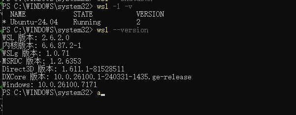
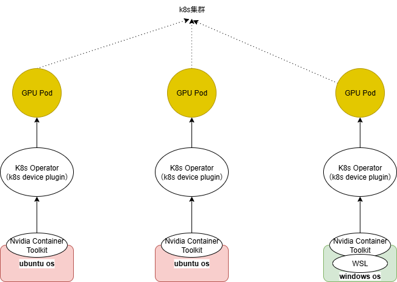
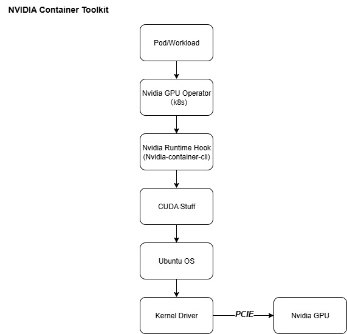

本文主要记录**WSL2下通过k8s管理GPU用于模型WDDM、推理和转码**的原理和流程，分为**部署、推理、转码**三个部分。

## 部署

### 环境

- 显卡：`4卡L20`或`8卡 5090`

- `WSL2`：

  

  1. `Wsl2：2.6.2.0`
  2. `Ubuntu：24.04`

- `Windows`：

  ​			

  1. `Windows：win11 23H2 22631.2428 `

### 架构图



- `pod`视角

​		`pod--> nvidia-cuda-toolkit --> wsl2 --> nvidia-container-toolkit --> windows driver`

​		

### 网络（Bridge）

- 原理图


- 效果图


- 配置方式

  1. `vSwitch`: Hyper-V创建Virtual Switches

  2. `.wslconfig`：用户目录配置`.wslconfig`，内容如下：

     ```ini
     [ws12]
     networkingMode-bridged
     vmSwitch=WSLBridge
     dhcp=false
     swap=0 ##K8S集群必须关闭SWAP
     ```

- 注意点：

  1. `Bridge`模式主要用于`K8S`的混合节点通信，对齐同一网络平面
  2. 默认的`Mirrored`无法支持
  3. `WSL2`的`Bridge`模式不支持挂载多张网卡

### Nvidia

#### Nvidia-Container-Toolkit

- 安装

  ```bash
  # Install the prerequisites for the instructions below:
  sudo apt-get update && sudo apt-get install -y --no-install-recommends \
     curl \
     gnupg2
  
  # Configure the production repository:
  curl -fsSL https://nvidia.github.io/libnvidia-container/gpgkey | sudo gpg --dearmor -o /usr/share/keyrings/nvidia-container-toolkit-keyring.gpg \
    && curl -s -L https://nvidia.github.io/libnvidia-container/stable/deb/nvidia-container-toolkit.list | \
      sed 's#deb https://#deb [signed-by=/usr/share/keyrings/nvidia-container-toolkit-keyring.gpg] https://#g' | \
      sudo tee /etc/apt/sources.list.d/nvidia-container-toolkit.list
  
  # Install the NVIDIA Container Toolkit packages:
  sudo apt-get update
  export NVIDIA_CONTAINER_TOOLKIT_VERSION=1.18.1-1
    sudo apt-get install -y \
        nvidia-container-toolkit=${NVIDIA_CONTAINER_TOOLKIT_VERSION} \
        nvidia-container-toolkit-base=${NVIDIA_CONTAINER_TOOLKIT_VERSION} \
        libnvidia-container-tools=${NVIDIA_CONTAINER_TOOLKIT_VERSION} \
        libnvidia-container1=${NVIDIA_CONTAINER_TOOLKIT_VERSION}
  ```

- 配置(`Containerd`)

  ```bash
  # Configure the container runtime by using the nvidia-ctk command:
  sudo nvidia-ctk runtime configure --runtime=containerd
  # Restart containerd:
  sudo systemctl restart containerd
  ```

#### Nvidia-Device-Plugin

- 作用

  ```markdown
  仅用于GPU的申请和调度
  ```

- Prerequisites

  ```markdown
  The list of prerequisites for running the NVIDIA device plugin is described below:
  
  NVIDIA drivers ~= 384.81
  nvidia-docker >= 2.0 || nvidia-container-toolkit >= 1.7.0 (>= 1.11.0 to use integrated GPUs on Tegra-based systems)
  nvidia-container-runtime configured as the default low-level runtime
  Kubernetes version >= 1.10
  ```

- Quick Start

  ```bash
  # 1. configure containerd
  # 2. Daemonset
  kubectl create -f https://raw.githubusercontent.com/NVIDIA/k8s-device-plugin/v0.17.1/deployments/static/nvidia-device-plugin.yml
  ```

#### Nvidia-CUDA-Toolkit

以`cuda 13.0.0和ubuntu 24.04`为例

- 13.0.0-base-ubuntu24.04（FFmpeg）

  ```markdown
  Includes the CUDA runtime (cudart)
  ```

- 13.0.0-runtime-ubuntu24.04（推理）

  ```markdown
  Builds on the base and includes the CUDA math libraries, and NCCL. A runtime image that also includes cuDNN is available. Some images may also include TensorRT.
  ```

- 13.0.0-devel-ubuntu24.04（构建）

  ```markdown
  Builds on the runtime and includes headers, development tools for building CUDA images. These images are particularly useful for multi-stage builds.
  ```

## 推理

#### vLLM

- 兼容性：

  1. `Qwen3-VL-32B`：`qwen3-vl`需要`vLLM>=0.11.0`，单卡显存不足，需要多卡
  2. 由于`WSL2`不支持`NCCL`的`P2P`，需要使用`SHM`进行多卡通信

- 部署

  ```yaml
  apiVersion: apps/v1
  kind: Deployment
  metadata:
    namespace: dev
    name: vllm-v1
    labels:
      app: vllm-v1
  spec:
    replicas: 1
    strategy:
      type: Recreate
    selector:
      matchLabels:
        app: vllm-v1
    template:
      metadata:
        labels:
          app: vllm-v1
      spec:
        nodeSelector:
          node-role.kubernetes.io/worker-gpu: "true"
        containers:
          - name: vllm
            env:
              - name: NCCL_CUMEM_ENABLE
                value: "0"
            image: docker.1ms.run/vllm/vllm-openai:v0.11.1
            imagePullPolicy: IfNotPresent
            command:
              - sh
              - -c
              - |
                vllm serve "/models/Qwen/Qwen3-VL-32B-Instruct" \
                --served-model-name "Qwen3-VL-32B-Instruct" \
                --tensor-parallel-size 4 \
                --port 9999 \
                --max-model-len 32768 \
                --gpu-memory-utilization 0.85 \
                --max-num-seqs 10 \
                --max-num-batched-tokens 32768 \
                --dtype bfloat16
            ports:
              - containerPort: 9999
                name: http
            resources:
              limits:
                nvidia.com/gpu: "4"
              requests:
                nvidia.com/gpu: "4"
            volumeMounts:
              - mountPath: /models
                name: qwen-data
                subPathExpr: models
              - mountPath: /dev/shm
                name: dshm
        volumes:
          - name: qwen-data
            persistentVolumeClaim:
              claimName: pvc-nas-test
          - name: dshm
            emptyDir:
              medium: Memory
              sizeLimit: 16G
  ```

## 转码

#### FFmpeg

- 兼容性：

  1. 安装：来源于`https://github.com/BtbN/FFmpeg-Builds`，也可以编译定制
  2. `WSL2`：由于`WSL2`默认只会自动挂载`libcuda.so`，`ffmpeg`对应的编解码需要手动挂载

- 部署

  ```yaml
  apiVersion: apps/v1
  kind: Deployment
  metadata:
    namespace: dev
    name: ffempeg-cuda-v1
    labels:
      app: ffempeg-cuda-v1
  spec:
    replicas: 1
    selector:
      matchLabels:
        app: ffempeg-cuda-v1
    template:
      metadata:
        name: ffempeg-cuda-v1
        labels:
          app: ffempeg-cuda-v1
      spec:
        containers:
          - name: ffempeg-cuda-v1
            image: docker.1ms.run/nvidia/cuda:12.6.3-base-ubuntu22.04
            imagePullPolicy: IfNotPresent
            command:
              - sh
              - -c
              - |
                tail -f /dev/null
        restartPolicy: Always
  ```

- 测试用例

  ```bash
  ./ffmpeg -hwaccel cuda -hwaccel_output_format cuda \
    -threads 2 \
    -i input.mp4 \
    -vf "scale_cuda=854:480" \
    -c:v h264_nvenc -preset p1 -cq 28 \
    -c:a copy -y output.mp4
  ```

## WDDM

#### L20

- 作用：`Windows`宿主机通过`WDDM`使用`dxdiag`识别显卡，支持运行`windows`的图形软件

- 支持模式

  

- 开启`Physical Display Modes`

  

- `TCC`改为`WDDM`

  

## 参考链接

- [CUDA on WSL User Guide](https://docs.nvidia.com/cuda/wsl-user-guide/index.html)

- [Nvidia Container Toolkit](https://docs.nvidia.com/datacenter/cloud-native/container-toolkit/latest/install-guide.html)
- [Nvidia device plugin for k8s](https://github.com/NVIDIA/k8s-device-plugin)

- [nvidia/cuda docker hub](https://hub.docker.com/r/nvidia/cuda)
- [NVIDIA Display Mode Selector Tool](https://developer.nvidia.com/displaymodeselector)
